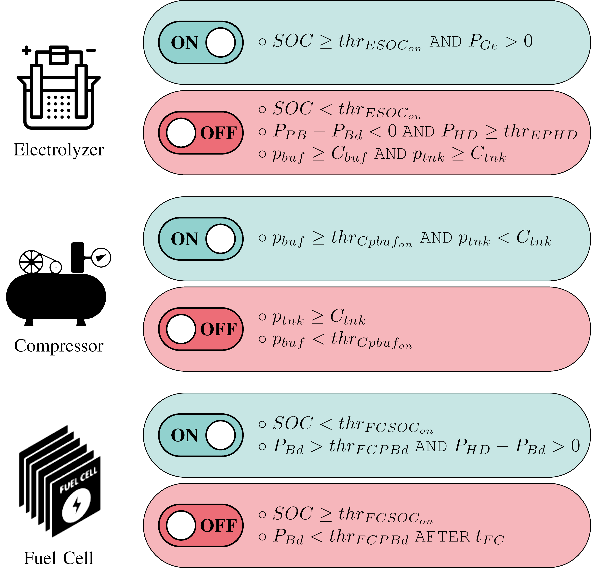

# HY2RES Digital Twin

## Table of contents
1. General Info
2. Getting Started
3. Authors
4. Acknowlegments

## 1. General Info

This tool is a digital twin (DT) that replicates the behavior of a renewable hydrogen-based energy system  (RHS).

The physical system corresponds to a pilot plant based on the hybridization of renewable energy system and hydrogen-based technologies to accomplish the 100% electrical self-sufficiency of a dwelling. The following figure depicts the configuration of the power system, providing a graphical visualization of the differnet modules of the pilot plant and the interaction between them.


Firstly, photovoltaic (PV) panels harvest the solar energy that is supplied to the home through a hybrid inverter. The existing surpluses are firstly stored in a battery pack, that saves energy in a day-to-day basis, after covering the electricity demand of the social house. Subsequently, in case of further surpluses, the electricity is employed to store energy in the form of hydrogen, which is generated by an electrolyzer, yielding seasonal energy accumulation. This hydrogen is sent to a buffer tank until the maximum pressure the electrolyzer can deliver is achieved. When the buffer reaches its maximum pressure, a compressor is triggered to accumulate the generated hydrogen in a high-pressure tank.
Finally, if additional electricity excesses exist, these are injected back to the grid, and sold to the utility grid company to obtain additional revenues.

Conversely, if there is not sufficient PV generation to meet the demand of the dwelling, the batteries cover the electricity deficit in a first stage. If the energy stored in the battery pack is not enough to ensure the continuous electrical supply, the fuel cell is triggered, either with the hydrogen stored in the buffer tank or in the high-pressure tank.The fuel cell can also charge the battery pack apart from covering the electricity required by the home.

The decision-making to switch on/off the electrolyzer, compressor or fuel cell is carried out by a PLC based on the comparison of the system variables with a predefined
set of thresholds, programmed into the PLC, as shown in the next figure. 



The DT is implemented as a set of software modules, each of them modeling the behavior of one or more components of the physical RHS. This modular approach facilitates the
validation and potential replacement of specific component models without disrupting the overall system. Furthermore, it enables the selection of the most suitable model (algorithmic or AI/ML based) for each component’s behavior.

A model-driven approach can be used when the underlying behavior is well known. Otherwise, AI/ML techniques, trained with the collected data from the real system, can be chosen in order to mimic the real operation of the RHS. 

The DT neural networks have been trained with data collected from a real system   and external data sources.


## 2. Getting Started

### Dependencies
It has been tested in Ubuntu 22.04.1 LTS (jammy). It has the following dependencies:

*   python3 and pip3
*   Keras
*   Tensorflow


### Executing program

For executing the digital twin, firstly configuration parameters can be checked in the [**config.json**](docs/config.md) file located in the config folder. It allows:
* Selection the models to replicate the behavior of each module.
* Configure the capacity of the modules 
* Configure thresholds for decision-making in the PLC
* Set the path to the [**input file**](docs/inputs.md).
* Set the path to the [**output file**](docs/outputs.md)

Once the execution has been configured, the digital twin can be run:
```
python3 hy2resgd.py
```


## 3. Authors

Laura Rodríguez de Lope - laura.rdelope@unican.es

Luis Diez - luisfrancisco.diez@unican.es

Ramón Agüero - ramon.agueroc@unican.es

Alfredo Ortiz - alfredo.ortizsainz@unican.es

Inmaculada Ortiz- inmaculada.ortiz@unican.es


## 4. Acknolegments

This work has been funded by the Spanish Government (Ministry of Science and Innovation) and the European Union (Next GenerationEU/RTRP) through the projects “Digital twin of a hybrid solar photovoltaic-hydro hybrid system for residential supply” (TED2021-129951B-C22) and ”Demonstration pilot of a solar-photovoltaic-hydrogen hybrid system for residential energy supply” (TED2021-129951B-C21), as well as by theGovernment of Cantabria through the project “Enabling Technologies for Digital Twins and their application in the chemical and communications sectors” (GDQuiC) of the TCNIC program (2023/TCN/002).
